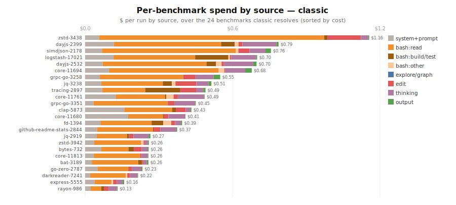
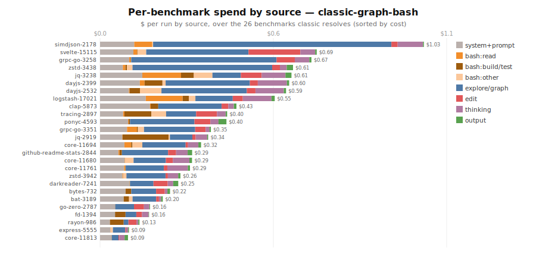
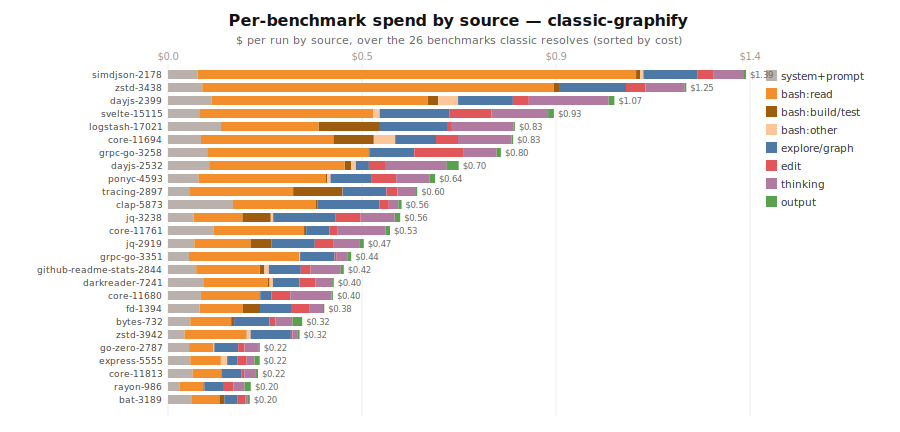

# ensemble vs standard-pi benchmark

A small, cheap cross-language benchmark that measures what the bash sidekick or ensemble
`explore` tool is supposed to buy: **resolving real issues for fewer tokens**. It runs the
same agent + model on the same [Multi-SWE-bench](https://github.com/multi-swe-bench/multi-swe-bench)
instances under different benchmark arms and grades the patches with the
official Docker eval harness.

## Latest results — base/002 (oca/gpt-5.5, multi-seed)

**What we're doing.** The expensive lead model spends roughly half its turns on read-only
exploration (grep/read) and on build/test runs. We try to move that work onto a cheap sidekick
to cut lead-model cost **without losing correctness**. Three arms: `classic` (pre-ensemble
baseline, raw bash), `classic-graphify` (lead drives the graphify graph itself via a hard
directive), `classic-graph-bash` (graph-backed `explore` + bash verdict digests on a cheap
sidekick). We count **only real fixes** (patches that pass the Docker eval, `resolved=1`) and
ask the candidate to be **strictly better** than classic: resolve a superset and cost no more
on the fixes both make (methodology: `docs/requirements.md` §REQ-002, §REQ-003).

**Set:** 30 balanced instances under the multi-seed `base/002` (pass@K = resolved in any seed). We
compare on the **benchmarks `classic` resolves** and report **$ per run** — each benchmark's cost
**averaged over an arm's seeds**, summed across benchmarks. Per-run (rather than summed-over-seeds)
keeps arms with different seed counts comparable — notably the single-run `codex` reference against
the 2-seed pi arms. All figures below are generated from the data (`node lib/plot-results.mjs`;
`node lib/inject-readme.mjs` for the tables) — see the tables for exact, current numbers.


**Cost per run.** `classic-graph-bash` is the cheapest; lead-driven `classic-graphify` is the
most expensive — its "always build the graph" directive inflates context, so on a balanced pool it
is *not* cheaper than the raw baseline.


**Same total (per run), split by token type** — input ×$5/Mtok + cached ×$0.5/Mtok + output ×$30/Mtok; this
reconciles to the cost graph. Output is few tokens but the priciest rate (~30% of the bill), which
is why the input+cached legs alone fall short. graph-bash cuts all three.


**Per-benchmark.** graph-bash is the shortest bar on most rows but loses to classic on a handful —
mostly graph-noise cases (`jq-3238`, `darkreader-7241`). The *classic-capped where worse* row in the
table is the ceiling if graph-bash fell back to classic on those: the regressions are cheap, and the
worst are exactly what the explore noise-exclusion experiment targets.

<!-- AUTO:cost-tables -->
#### Cost on the 26 benchmarks classic resolves — $ per run (averaged over an arm's seeds)

| arm | resolved | input $ | cached $ | output $ | **avg $/run** | **total $** | Δ vs classic |
|---|---|---|---|---|---|---|---|
| classic | 26/26 | $5.36 | $3.85 | $3.78 | **$0.50** | **$12.99** | — |
| classic-graphify | 25/26 | $6.19 | $4.63 | $4.08 | **$0.57** | **$14.90** | 14.7% |
| classic-graph-bash | 25/26 | $4.31 | $2.58 | $3.13 | **$0.39** | **$10.02** | -22.9% |
| codex *(ref)* | 21/26 | $5.78 | $8.05 | $6.83 | **$0.79** | **$20.67** | 59.1% |
| graph-bash, classic-capped where worse | 26/26 | — | — | — | **$0.37** | **$9.54** | -26.6% |

_codex is a reference arm (external Codex CLI); it spends on all 26 but resolves only 21, so its total is not a like-for-like fix cost._

#### Per-benchmark cost on classic's wins ($)

| benchmark | classic | classic-graphify | classic-graph-bash | codex |
|---|---|---|---|---|
| dayjs-2532 | $1.056 | $0.699 | $0.590 | $1.020 |
| zstd-3438 | $1.032 | $1.247 | $0.612 | $1.697 |
| svelte-15115 | $0.923 | _$0.928_ | _$0.688_ | $1.472 |
| simdjson-2178 | $0.823 | $1.390 | $1.028 | _$1.425_ |
| grpc-go-3351 | $0.754 | $0.441 | $0.352 | $0.484 |
| dayjs-2399 | $0.750 | $1.074 | $0.600 | $1.093 |
| core-11694 | $0.670 | $0.830 | $0.321 | $1.073 |
| logstash-17021 | $0.641 | $0.835 | $0.554 | _$2.613_ |
| grpc-go-3258 | $0.631 | $0.801 | $0.671 | $0.847 |
| ponyc-4593 | $0.524 | $0.643 | $0.401 | _$0.569_ |
| core-11761 | $0.497 | $0.534 | $0.286 | $0.648 |
| github-readme-stats-2844 | $0.453 | $0.423 | $0.292 | _$0.341_ |
| jq-3238 | $0.448 | $0.559 | $0.608 | _$1.284_ |
| tracing-2897 | $0.446 | $0.599 | $0.403 | $0.809 |
| clap-5873 | $0.430 | $0.562 | $0.433 | $0.749 |
| fd-1394 | $0.393 | $0.376 | $0.156 | $0.258 |
| core-11680 | $0.374 | $0.397 | $0.292 | $0.600 |
| darkreader-7241 | $0.344 | $0.399 | $0.248 | $0.440 |
| bat-3189 | $0.322 | $0.197 | $0.199 | $0.502 |
| jq-2919 | $0.282 | $0.471 | $0.343 | $0.808 |
| zstd-3942 | $0.245 | $0.316 | $0.255 | $0.523 |
| core-11813 | $0.232 | $0.216 | $0.089 | $0.243 |
| bytes-732 | $0.226 | $0.323 | $0.222 | $0.304 |
| go-zero-2787 | $0.222 | $0.221 | $0.159 | $0.293 |
| express-5555 | $0.151 | $0.220 | $0.092 | $0.279 |
| rayon-986 | $0.123 | $0.199 | $0.125 | $0.294 |
| **total** | **$12.99** | **$14.90** | **$10.02** | **$20.67** |

(italic = arm ran but did not resolve that benchmark; "—" = no run)
<!-- /AUTO:cost-tables -->

### Where the money goes — spend attribution by source

To see *what* to optimize, we attribute each arm's spend to what produced it. For every assistant
turn the API bills `input + cacheRead` (the context read that turn) + `output` (what it generated);
we split those across the blocks present that turn, proportional to size, and aggregate per category
($ per run) over the benchmarks classic resolves. `classic`/`graphify` have no separate read tool — they read files by running
`ls`/`sed`/`rg`/`find` through **bash**, so we split bash by command (`bash:read` = file discovery,
`bash:build/test`, `bash:other`); `graphify`'s `graphify query` graph calls are counted as
`explore/graph`. Generated by `node lib/token-breakdown.mjs`. Two views (totals match the cost graph):


<!-- AUTO:breakdown-tables -->
#### Full $ (input+cached+output) by source — over classic's wins

| source | classic | classic-graphify | classic-graph-bash |
|---|---|---|---|
| system+prompt | $1.57 | $1.92 | $2.10 |
| bash:read | $7.71 | $6.72 | $0.34 |
| bash:build/test | $0.53 | $0.68 | $0.54 |
| bash:other | $0.62 | $0.20 | $0.38 |
| explore/graph | $0.00 | $2.37 | $4.67 |
| edit | $0.88 | $0.94 | $0.82 |
| thinking | $1.48 | $1.83 | $0.97 |
| output | $0.21 | $0.23 | $0.21 |
| **total** | **$12.99** | **$14.90** | **$10.02** |

#### Context only (input+cached) by source — over classic's wins

| source | classic | classic-graphify | classic-graph-bash |
|---|---|---|---|
| system+prompt | $1.54 | $1.92 | $2.05 |
| bash:read | $6.68 | $5.73 | $0.17 |
| bash:build/test | $0.30 | $0.38 | $0.42 |
| bash:other | $0.28 | $0.06 | $0.16 |
| explore/graph | $0.00 | $2.21 | $3.77 |
| edit | $0.16 | $0.14 | $0.13 |
| thinking | $0.26 | $0.38 | $0.19 |
| **total** | **$9.21** | **$10.82** | **$6.89** |
<!-- /AUTO:breakdown-tables -->

**Reading it** (exact $ in the table above):
- **`bash:read` (file discovery) is the dominant cost** — ~58% of `classic`'s spend. This is the lead
  searching/reading source via shell, re-read into context every turn.
- **graph-bash replaces it with the explore sidekick**: `bash:read` collapses to ~zero, swapped for a
  smaller `explore/graph` (discovery done off the lead's context) — the source of its lead.
- **graphify is the most expensive because the graph *didn't replace* reading** — it still does
  `bash:read` **and** adds `explore/graph`. It pays for both.
- **build/test is tiny everywhere** — not a lever; the lead redirects build output to files.
- **Remaining levers**: for graph-bash, `explore/graph` (graph noise-exclusion) and the
  `system+prompt` overhead; for graphify, stop the lead's manual `bash:read` once it has the graph.

Method note: the split uses char/4 size estimates and the latest sessions, scaled to the seed-1
measured totals so all graphs reconcile; per-arm totals are exact, the split is approximate. codex
has no per-block session, so it is excluded from this view.

#### Per-benchmark spend by source

The same attribution, but **one stacked bar per benchmark** (sorted by cost) so you can see where the
spend goes on each individual problem — e.g. which benchmarks are `bash:read`-heavy vs `explore/graph`-
heavy. One graph per arm; `$ per run` by source.





**Caveats:** multi-seed `base/002` — **pass@K** correctness, **$ per run** cost (averaged over an
arm's seeds). At pass@2, `classic-graph-bash` is **23/24** — it misses `logstash-17021` (a regression
vs classic), while `classic-graphify` is 24/24 (most correct, dearest). `codex` is an external
reference captured as a single instrumented run (`cdx --json`, `lib/codex-metrics.mjs`); the per-run
framing makes that one run comparable, and it lands as the most expensive arm (it also resolves fewer,
so it isn't a like-for-like fix cost). The historical single-seed benchmarks-20 milestone (graph-bash
11/20 ⊇ classic 8/20) is in `docs/experiments.md`.

### Next experiments

Full ledger + rationale: [`docs/experiments.md`](../docs/experiments.md). Given the base/002 data we run
**one focused experiment**, with the rest reprioritized:

- **Active — [DF-015: explore returns source on code-intent + noise-node exclusion](../docs/decisions/functional/DF-015-explore-return-source-on-code-intent.md)**
  (branch `exp/explore-source-on-intent`, off `base/002-30`). Closes graph-bash's two cost regressions
  (`simdjson-2178` +30%, `jq-3238` +33%): make the explore sidekick return *code* — not BFS node-name
  dumps — when the lead asks for source, and drop vendored/test/generated graph nodes.
- **Shelved** — [DA-002 compile-test-fix sidekick](../docs/decisions/architectural/DA-002-compile-test-fix-sidekick.md):
  the data falsifies its premise (`build/test` is ~$0.4/run, not the lever).
  [DF-013 amalgamation-awareness](../docs/decisions/functional/DF-013-graphify-amalgamation-awareness.md) is folded into DF-015.
- **Deferred (correctness track)** — [DF-010 case-set surfacing](../docs/decisions/functional/DF-010-explore-surface-test-caseset.md),
  [DF-011 shared-chokepoint](../docs/decisions/functional/DF-011-explore-shared-chokepoint.md),
  [DF-012 lead hermetic verify](../docs/decisions/functional/DF-012-lead-hermetic-verify.md): target the
  lone correctness regression (`logstash-17021`), to revisit after DF-015.

## Benchmark Arms

| Arm | Flags | What it isolates |
|-----|-------|------------------|
| `classic` | `--exploration classic` + raw bash output | baseline: pre-ensemble pi (read/grep/find/ls) |
| `classic-bash` | `--exploration classic` + bash sidekick output digest | bash digest only, with classic file exploration |
| `classic-graph-bash` | `--exploration sidekick` + graphify graph prebuilt + bash sidekick output digest | graph-backed explore with bash digest |
| `classic-graph` | `--exploration sidekick` + graphify graph prebuilt, asserted graph-derived | graph-backed explore |
| `sidekick-fs` | `--exploration sidekick`, graphify forced unavailable | same tool, filesystem fallback |

Legacy names still work for old runs: `graph-bash` = `classic-graph-bash`,
`ensemble-strict` = `classic-graph`.

> **Strict mode is genuinely enforced via `PI_REQUIRE_GRAPH=1`** (FS-001 §7.4 required-graph
> — an env var, not a CLI flag). With it set, pi fail-fasts at startup if graphify isn't
> enabled and `explore` throws rather than ever falling back (`explore.ts:842`, `main.ts:592`).
> The `classic-graph` and `classic-graph-bash` arms set it and prebuild the graph; `lib/parse-session.mjs`
> additionally asserts every `explore` call was graph-derived as a belt-and-suspenders check
> (`strictOk`).

## Prerequisites

- `graphify` on `PATH` (for graph arms) — present at `~/.local/bin/graphify`.
- Docker running (for grading).
- `pip install multi-swe-bench` (provides the eval harness).
- Model creds in the env. Default is **gpt-5.5 via OpenRouter** (`PROVIDER=openrouter
  MODEL=openai/gpt-5.5`, needs `OPENROUTER_API_KEY`; ~$5/$30 per Mtok). Override
  `PROVIDER`/`MODEL` for anything else, e.g. `PROVIDER=openrouter MODEL=openai/gpt-5-mini`.

## Run it

```bash
cd bench

# 1. Pick instances (one per language keeps it cheap). Preview, then fetch:
node fetch-instances.mjs --list                 # list language configs
node fetch-instances.mjs --list go              # preview go instances
node fetch-instances.mjs go 0                   # save instances/<id>.json
node fetch-instances.mjs rust 0 && node fetch-instances.mjs typescript 0 && node fetch-instances.mjs python 0

# 2. Dry run the plumbing first (no paid agent calls):
DRY_RUN=1 ./run-all.sh

# 3. Real runs (all instances x all arms), then Docker grade + collect automatically:
./run-all.sh                                    # MODEL/ARMS overridable from env
```

Useful flags:

```bash
./run-all.sh --langs cpp,js --arms classic,classic-bash
./run-all.sh --instances simdjson__simdjson-2178 --arms classic,classic-bash
./run-all.sh --csv /tmp/bench-instances.csv --arms classic,classic-bash
BENCH_LANGS='cpp js' ARMS='classic-bash classic' ./run-all.sh
BENCH_INSTANCES='simdjson__simdjson-2178,sveltejs__svelte-15115' ./run-all.sh

NO_CLASSIC=1 ./run-all.sh        # run configured arms except classic
REUSE_CLASSIC=1 ./run-all.sh     # skip classic agent runs, but keep old classic rows
SKIP_EVAL=1 ./run-all.sh         # skip Docker grading; collect from existing reports if present
REUSE_EVAL=1 ./run-all.sh        # run agents, but keep existing final_report.json per arm
```

Stable 20-case benchmark:

```bash
./run-all.sh --csv benchmarks-20.csv --arms classic,classic-bash,classic-graph-bash,classic-graph
```

Rerun one fixed benchmark and update only that benchmark's current number:

```bash
./run-all.sh --instances clap-rs__clap-5873 --arms classic-graph-bash
node collect.mjs
```

Prebuilt sweeps:

```bash
./run-hard.sh          # curated mixed-language hard cases
./run-hard-diverse.sh  # large mixed-language repos, including jq/zstd/ponyc C coverage
./verify-batch-2-graphify.sh  # graphify-only preflight for batch 2
./run-batch-2.sh      # batch 2: C-only sweep across jq, zstd, and ponyc
./verify-batch-3-graphify.sh  # graphify-only preflight for batch 3
./run-batch-3.sh      # batch 3: known graph-win cases
./run-hard-all.sh      # run-hard + run-hard-diverse
```

The headline is the `collect.mjs` summary: **resolved-rate and $/run & tokens/run per
arm.** If `classic-bash` resolves the same issues as `classic` at lower tokens/cost,
that's the isolated bash-sidekick win. If `classic-graph` resolves the same issues as
`classic` at lower tokens/cost, that's the graph-explore win.

`run-all.sh` invokes `eval/run-eval.sh` after real runs (skipped for `DRY_RUN=1`) and then
runs `collect.mjs`, so `results/results.csv` is produced immediately. `eval/run-eval.sh` can
still be run directly to re-grade existing patches.

## Cost

Tiny by design. ~$0.5–2 per agent run on gpt-5.5; 4 instances × 3 arms ≈ **$6–25**.
It scales linearly — 50 instances would be $100+. Keep `instances/` small.

## Layout

```
config.sh            knobs: MODEL, ARMS, pricing, paths
fetch-instances.mjs  HF datasets-server -> instances/<id>.json
run-instance.sh      one (instance, arm): clone@sha, graphify, agent, diff, metrics
run-all.sh           loop instances x arms, then Docker grade + collect
lib/build-prompt.mjs resolved_issues -> leak-free problem statement
lib/parse-session.mjs session jsonl -> tokens/cost/turns + strict assertion
lib/inst-env.mjs     instance json -> shell vars
eval/run-eval.sh     wraps multi_swe_bench.harness.run_evaluation
collect.mjs          metrics + final_report.json -> results.csv + summary
work/  raw/  raw-history/  patches/  instances/  results/   (generated; git-ignored)
```

## Run bundle format

Every `(instance, arm)` run writes a self-describing bundle under `raw/<id>__<arm>/`,
pinned to the product commit it ran against:

```
manifest.json          commit (+ dirty flag), model/provider, arm, exploration, require_graph
prompts/
  lead-explore-tool.txt    the explore tool as the LEAD agent sees it (desc + guidelines + params)
  sidekick-graph.txt       explore sub-agent prompt, graph-backed mode
  sidekick-filesystem.txt  explore sub-agent prompt, filesystem-fallback mode
  NOTE.txt                 (classic/classic-bash arms — no explore sidekick; base prompt pinned by commit)
session/*.jsonl        all LEAD-agent turns + tool calls
explore-debug.jsonl    all SIDEKICK tool calls (PI_EXPLORE_DEBUG=full; sidekick arms only)
agent.out / agent.err  logs
graphify.log           initial graph build log (strict arm)
graphify-watch.log     continuous graph update log (strict arm)
metrics.json           tokens/cost/turns/strict     patch.diff / patch.jsonl
```

So each run carries **both prompts + all tool calls (lead & sidekick) + logs, linked to a
commit**. Prompts are dumped from source via `lib/dump-prompts.mjs` (which imports the exported
`exploreSidekickSystemPrompt` / `createExploreToolDefinition`), so they match the committed code
exactly. `manifest.json.dirty=true` warns that the tree had uncommitted changes — commit before
runs you intend to publish, so `commit` fully pins the prompts. Archive a set with
`snapshots/<name>/` (tracked; the live `raw/` is git-ignored).

Reruns are preserved automatically. Before `raw/<id>__<arm>/` is replaced, the previous bundle is
moved to `raw-history/<id>__<arm>/<timestamp>/`. Docker validation writes
`results/validation/<arm>/<id>.json`; older validation records and overwritten arm-level reports
are copied under `results/history/`. `collect.mjs` reads these per-instance validation records, so
partial reruns update only the rerun benchmark's resolved number.

## Caveats

- **graphify language coverage** — verify it produces a non-trivial `graph.json` for each
  language (`run-instance.sh` warns if not). If a language yields an empty graph,
  `classic-graph` ≡ `sidekick-fs` for it and the comparison is void there.
- The agent is told not to touch test files; the grader applies the instance's own
  `test_patch`. Strict runs keep graph artifacts under `raw/<id>__<graph-arm>/graphify/`
  and update them with `graphify watch`; `graphify-out/` is also excluded from the captured
  patch as a fallback.
- The eval harness config field names are verified against the current
  `multi-swe-bench` `CliArgs` schema (`mode`/`workdir`/`patch_files`/`dataset_files`/
  `log_dir` are the required ones); bump `eval/run-eval.sh` if the harness schema changes.

---

# DF-022 — Sidekick Model Comparison

> Cite as **DF-022** (`bench/README.md#df-022--sidekick-model-comparison`). Self-contained result:
> can a cheap open model replace `gpt-5.5` as the `explore` sidekick, and what does it cost?

**What we tested.** Hold the lead model fixed (`oca/gpt-5.5`) and swap only the `explore` **sidekick**
model (`PI_EXPLORE_MODEL=<provider>:<id>`), to see whether a cheap open model can do the bounded
exploration the lead would otherwise pay premium rates for. Arm `graph-bash`, full `base/002-30`
cascade, K=3 (each seed: run → eject instances that loop/time out → grade survivors → carry forward).

**The loop pathology.** Weak sidekicks don't *fail* the task — they fail to **stop**. They re-issue the
same `source_slice`/`search` call dozens–to–hundreds of times (one file sliced 600+×) instead of
returning a product, blowing the 1200s agent wall-clock. The `Agent` loop has no turn cap and the
soft "already returned…" guards are simply ignored. Measured per-run explore-tool calls: gpt-oss
median 18; Devstral 2 median 97 (max 788); Qwen3-Coder-30B loops on **73%** of instances.

**The fix — repeat-guard** (`explore.ts`, env-gated, default off so baseline is unchanged):
`PI_EXPLORE_MAX_CALLS` (total tool calls/explore) and `PI_EXPLORE_MAX_REPEAT` (per-identical-call).
On trip it disables further tool work and forces the sidekick to finalize, salvaging the evidence
already gathered. At `MAX_CALLS=64, MAX_REPEAT=4` it converts Qwen's loops into completions:
seed-1 eject **73% → 3%**, and a smoke case (`darkreader`) went from 600s-timeout/0-byte-patch to
187s/554-byte patch.

**Seed-1 comparison on `base/002-30`** (all arms start from 30 instances; resolved/30 counts a
loop/eject as a failure — the honest denominator):

| sidekick | size | loop/eject | completed | **resolved /30** | resolved /completed | lead tok/run | sidekick tok/run |
|---|---|---:|---:|---:|---:|---:|---:|
| `gpt-5.5` (lead = sidekick) | — | 0% | 30 | **24 (80%)** | 80% | 214K¹ | — |
| `qwen3-coder-30b` **+ guard** | 30B | 3% (1) | 29 | **21 (70%)** | 72% | 316K | 715K |
| `devstral-2512` | 123B | 27% (8) | 22 | **18 (60%)** | 85% | 149K | 6.09M² |
| `qwen3-coder-30b` *(no guard)* | 30B | 73% (22) | 8 | 7 (23%) | 87% | 218K | 659K |
| `gpt-oss-120b` | 120B | —³ | —³ | —³ | 7/8 (pass@3) | 228K | 76K |

¹ gpt-5.5 baseline is a single flat figure — lead and in-model explore aren't separable (a combined floor).
² Devstral 2's sidekick tokens are ~97% cacheRead (cheap). ³ gpt-oss ran only on the 8-survivor
subset (the devstral2 active-ids), so it has no resolved/30.

**Guard durability across seeds (Qwen + guard, K=3, complete):** per-seed resolution 21/29, 22/29,
23/27; ejects 1 / 0 / 2 (3 total over the whole run vs the unguarded run's 22 in one seed). On the
**27 instances present in all three seeds: pass@3 = 23/27 (85%)** (resolved in ≥1 seed) and
**stable@3 = 19/27 (70%)** (resolved in all 3) — a *higher* stable-across-seeds rate than Devstral 2
(6/22 = 27%) or gpt-oss (5/8 = 62%). The guard's fix holds across seeds; it is not a seed-1 fluke.

**Findings.**
- **Resolution-of-30:** gpt-5.5 80% > **guarded Qwen 70%** > Devstral 2 60% > unguarded Qwen 23%.
  Guarded Qwen beats Devstral 2 here *despite lower per-instance quality* (72% vs 85%) because its
  near-zero eject rate means far more instances even produce a patch — completion rate dominates.
- **The cheap-sidekick economics paradox.** The point of a cheap sidekick is to move tokens off the
  premium lead. **Devstral 2 does** (lead 149K < gpt-5.5 baseline 214K — a real offload). **Guarded
  Qwen does not**: its lead alone (316K) *exceeds* the entire all-gpt-5.5 baseline, because the weaker,
  guard-truncated digests make the lead work harder — you pay more premium tokens *plus* 715K Qwen
  tokens. Cheap per-token ≠ cheap overall.
- **Verdict.** gpt-5.5 = best quality/reliability, all-premium cost. **Devstral 2 (123B) = best
  cheap-sidekick tradeoff** (genuine lead offload, 85% per-instance quality, moderate loops).
  **Qwen-30B is viable only with the guard** (rescued 23%→70%) but saves nothing on the premium model.
  Unguarded Qwen is unusable. Fine-tuning Qwen is therefore optional polish (trim turn count), not a
  rescue — the harness guard already does the rescue.
- **Devstral-mini (24B)** is queued, not run: not on OpenRouter, and `MISTRAL_API_KEY`/Vercel keys
  are unset.

Artifacts: `multiseed/df022-graph-bash-sidekicks/{devstral2-120b,gpt-oss-120b,qwen3-coder-30b,qwen3-coder-30b-guarded}/`
(per-seed snapshots + `REPORT.txt`), ejects in `dropped.tsv`. Drivers:
`df022-qwen-cascade.sh` (+ `df022-loop-killer.sh`, an external watchdog superseded by the in-agent guard).
