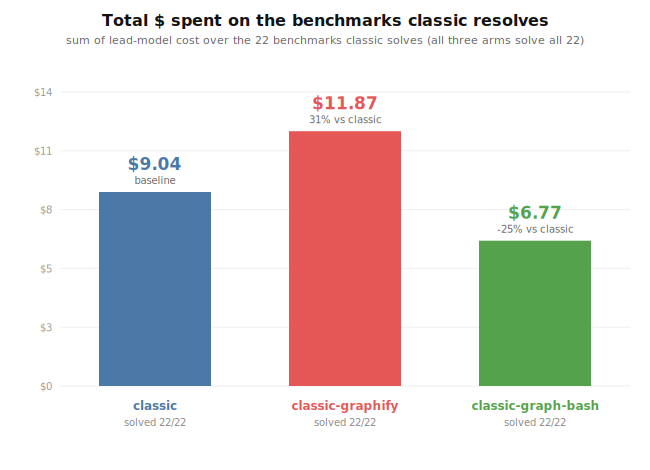
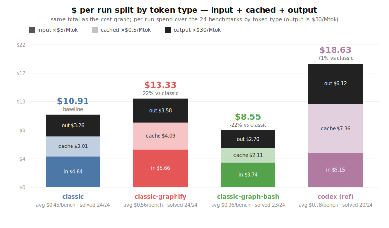
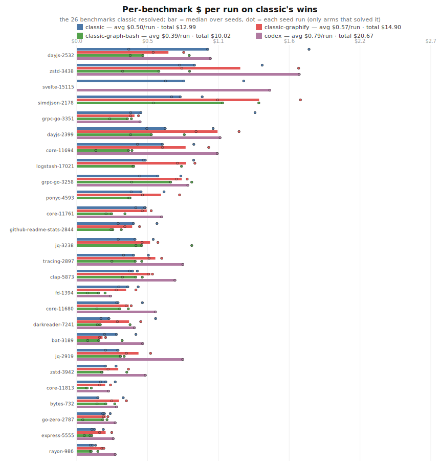
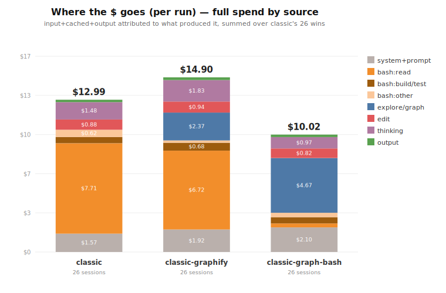
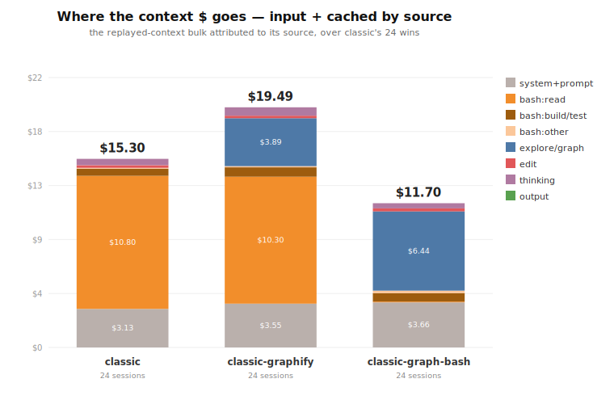

# ensemble vs standard-pi benchmark

A small, cheap cross-language benchmark that measures what the bash sidekick or ensemble
`explore` tool is supposed to buy: **resolving real issues for fewer tokens**. It runs the
same agent + model on the same [Multi-SWE-bench](https://github.com/multi-swe-bench/multi-swe-bench)
instances under different benchmark arms and grades the patches with the
official Docker eval harness.

## Latest results — base/002 (oca/gpt-5.5, multi-seed)

**What we're doing.** The expensive lead model spends roughly half its turns on read-only
exploration (grep/read) and on build/test runs. We try to move that work onto a cheap sidekick
to cut lead-model cost **without losing correctness**. Three arms: `classic` (pre-ensemble
baseline, raw bash), `classic-graphify` (lead drives the graphify graph itself via a hard
directive), `classic-graph-bash` (graph-backed `explore` + bash verdict digests on a cheap
sidekick). We count **only real fixes** (patches that pass the Docker eval, `resolved=1`) and
ask the candidate to be **strictly better** than classic: resolve a superset and cost no more
on the fixes both make (methodology: `docs/requirements.md` §REQ-002, §REQ-003).

**Set:** 30 balanced instances under the multi-seed `base/002` (pass@K = resolved in any seed). We
compare on the **benchmarks `classic` resolves** and report **$ per run** — each benchmark's cost
**averaged over an arm's seeds**, summed across benchmarks. Per-run (rather than summed-over-seeds)
keeps arms with different seed counts comparable — notably the single-run `codex` reference against
the 2-seed pi arms. All figures below are generated from the data (`node lib/plot-results.mjs`;
`node lib/inject-readme.mjs` for the tables) — see the tables for exact, current numbers.



**Total cost.** `classic-graph-bash` is the cheapest in total; lead-driven `classic-graphify` is the
most expensive — its "always build the graph" directive inflates context, so on a balanced pool it
is *not* cheaper than the raw baseline.



**Same total, split by token type** — input ×$5/Mtok + cached ×$0.5/Mtok + output ×$30/Mtok; this
reconciles to the cost graph. Output is few tokens but the priciest rate (~30% of the bill), which
is why the input+cached legs alone fall short. graph-bash cuts all three.



**Per-benchmark.** graph-bash is the shortest bar on most rows but loses to classic on a handful —
mostly graph-noise cases (`jq-3238`, `darkreader-7241`). The *classic-capped where worse* row in the
table is the ceiling if graph-bash fell back to classic on those: the regressions are cheap, and the
worst are exactly what the explore noise-exclusion experiment targets.

<!-- AUTO:cost-tables -->
#### $ per run on the 24 benchmarks classic resolves (averaged over seeds)

| arm | resolved | input $ | cached $ | output $ | **total $** | Δ vs classic |
|---|---|---|---|---|---|---|
| classic | 24/24 | $4.64 | $3.01 | $3.26 | **$10.91** | — |
| classic-graphify | 24/24 | $5.66 | $4.09 | $3.58 | **$13.33** | 22.1% |
| classic-graph-bash | 23/24 | $3.74 | $2.11 | $2.70 | **$8.55** | -21.6% |
| codex *(ref)* | 20/24 | $5.15 | $7.36 | $6.12 | **$18.63** | 70.7% |
| graph-bash, classic-capped where worse | 24/24 | — | — | — | **$7.96** | -27.1% |

_codex is a reference arm (external Codex CLI); it spends on all 24 but resolves only 20, so its total is not a like-for-like fix cost._

#### Per-benchmark cost on classic's wins ($)

| benchmark | classic | classic-graphify | classic-graph-bash | codex |
|---|---|---|---|---|
| zstd-3438 | $1.156 | $1.247 | $0.488 | $1.697 |
| dayjs-2399 | $0.787 | $1.074 | $0.616 | $1.093 |
| simdjson-2178 | $0.756 | $1.390 | $0.986 | _$1.425_ |
| logstash-17021 | $0.700 | $0.835 | _$0.614_ | _$2.613_ |
| dayjs-2532 | $0.698 | $0.699 | $0.456 | $1.020 |
| core-11694 | $0.678 | $0.830 | $0.270 | $1.073 |
| grpc-go-3258 | $0.550 | $0.801 | $0.568 | $0.847 |
| jq-3238 | $0.514 | $0.559 | $0.686 | _$1.284_ |
| tracing-2897 | $0.490 | $0.599 | $0.357 | $0.809 |
| core-11761 | $0.486 | $0.534 | $0.295 | $0.648 |
| grpc-go-3351 | $0.450 | $0.441 | $0.402 | $0.484 |
| clap-5873 | $0.433 | $0.562 | $0.399 | $0.749 |
| core-11680 | $0.408 | $0.397 | $0.241 | $0.600 |
| fd-1394 | $0.395 | $0.376 | $0.126 | $0.258 |
| github-readme-stats-2844 | $0.374 | $0.423 | $0.268 | _$0.341_ |
| jq-2919 | $0.266 | $0.471 | $0.348 | $0.808 |
| zstd-3942 | $0.259 | $0.316 | $0.288 | $0.523 |
| bytes-732 | $0.258 | $0.323 | $0.222 | $0.304 |
| core-11813 | $0.258 | $0.216 | $0.093 | $0.243 |
| bat-3189 | $0.257 | $0.197 | $0.215 | $0.502 |
| go-zero-2787 | $0.233 | $0.221 | $0.123 | $0.293 |
| darkreader-7241 | $0.215 | $0.399 | $0.282 | $0.440 |
| express-5555 | $0.159 | $0.220 | $0.080 | $0.279 |
| rayon-986 | $0.132 | $0.199 | $0.132 | $0.294 |
| **total** | **$10.91** | **$13.33** | **$8.55** | **$18.63** |

(italic = arm ran but did not resolve that benchmark; "—" = no run)
<!-- /AUTO:cost-tables -->

### Where the money goes — spend attribution by source

To see *what* to optimize, we attribute each arm's spend to what produced it. For every assistant
turn the API bills `input + cacheRead` (the context read that turn) + `output` (what it generated);
we split those across the blocks present that turn, proportional to size, and aggregate per category
($ per run) over the benchmarks classic resolves. `classic`/`graphify` have no separate read tool — they read files by running
`ls`/`sed`/`rg`/`find` through **bash**, so we split bash by command (`bash:read` = file discovery,
`bash:build/test`, `bash:other`); `graphify`'s `graphify query` graph calls are counted as
`explore/graph`. Generated by `node lib/token-breakdown.mjs`. Two views (totals match the cost graph):




<!-- AUTO:breakdown-tables -->
#### Full $ (input+cached+output) by source — over classic's wins

| source | classic | classic-graphify | classic-graph-bash |
|---|---|---|---|
| system+prompt | $1.60 | $1.78 | $1.86 |
| bash:read | $6.33 | $6.00 | $0.12 |
| bash:build/test | $0.54 | $0.67 | $0.44 |
| bash:other | $0.14 | $0.18 | $0.24 |
| explore/graph | $0.00 | $2.10 | $3.80 |
| edit | $0.70 | $0.78 | $0.89 |
| thinking | $1.39 | $1.62 | $1.03 |
| output | $0.20 | $0.20 | $0.18 |
| **total** | **$10.91** | **$13.33** | **$8.55** |

#### Context only (input+cached) by source — over classic's wins

| source | classic | classic-graphify | classic-graph-bash |
|---|---|---|---|
| system+prompt | $1.57 | $1.78 | $1.83 |
| bash:read | $5.40 | $5.15 | $0.03 |
| bash:build/test | $0.28 | $0.38 | $0.34 |
| bash:other | $0.04 | $0.05 | $0.10 |
| explore/graph | $0.00 | $1.95 | $3.22 |
| edit | $0.10 | $0.10 | $0.12 |
| thinking | $0.26 | $0.34 | $0.21 |
| **total** | **$7.65** | **$9.74** | **$5.85** |
<!-- /AUTO:breakdown-tables -->

**Reading it** (exact $ in the table above):
- **`bash:read` (file discovery) is the dominant cost** — ~58% of `classic`'s spend. This is the lead
  searching/reading source via shell, re-read into context every turn.
- **graph-bash replaces it with the explore sidekick**: `bash:read` collapses to ~zero, swapped for a
  smaller `explore/graph` (discovery done off the lead's context) — the source of its lead.
- **graphify is the most expensive because the graph *didn't replace* reading** — it still does
  `bash:read` **and** adds `explore/graph`. It pays for both.
- **build/test is tiny everywhere** — not a lever; the lead redirects build output to files.
- **Remaining levers**: for graph-bash, `explore/graph` (graph noise-exclusion) and the
  `system+prompt` overhead; for graphify, stop the lead's manual `bash:read` once it has the graph.

Method note: the split uses char/4 size estimates and the latest sessions, scaled to the seed-1
measured totals so all graphs reconcile; per-arm totals are exact, the split is approximate. codex
has no per-block session, so it is excluded from this view.

**Caveats:** multi-seed `base/002` — **pass@K** correctness, **$ per run** cost (averaged over an
arm's seeds). At pass@2, `classic-graph-bash` is **23/24** — it misses `logstash-17021` (a regression
vs classic), while `classic-graphify` is 24/24 (most correct, dearest). `codex` is an external
reference captured as a single instrumented run (`cdx --json`, `lib/codex-metrics.mjs`); the per-run
framing makes that one run comparable, and it lands as the most expensive arm (it also resolves fewer,
so it isn't a like-for-like fix cost). The historical single-seed benchmarks-20 milestone (graph-bash
11/20 ⊇ classic 8/20) is in `docs/experiments.md`.

## Benchmark Arms

| Arm | Flags | What it isolates |
|-----|-------|------------------|
| `classic` | `--exploration classic` + raw bash output | baseline: pre-ensemble pi (read/grep/find/ls) |
| `classic-bash` | `--exploration classic` + bash sidekick output digest | bash digest only, with classic file exploration |
| `classic-graph-bash` | `--exploration sidekick` + graphify graph prebuilt + bash sidekick output digest | graph-backed explore with bash digest |
| `classic-graph` | `--exploration sidekick` + graphify graph prebuilt, asserted graph-derived | graph-backed explore |
| `sidekick-fs` | `--exploration sidekick`, graphify forced unavailable | same tool, filesystem fallback |

Legacy names still work for old runs: `graph-bash` = `classic-graph-bash`,
`ensemble-strict` = `classic-graph`.

> **Strict mode is genuinely enforced via `PI_REQUIRE_GRAPH=1`** (FS-001 §7.4 required-graph
> — an env var, not a CLI flag). With it set, pi fail-fasts at startup if graphify isn't
> enabled and `explore` throws rather than ever falling back (`explore.ts:842`, `main.ts:592`).
> The `classic-graph` and `classic-graph-bash` arms set it and prebuild the graph; `lib/parse-session.mjs`
> additionally asserts every `explore` call was graph-derived as a belt-and-suspenders check
> (`strictOk`).

## Prerequisites

- `graphify` on `PATH` (for graph arms) — present at `~/.local/bin/graphify`.
- Docker running (for grading).
- `pip install multi-swe-bench` (provides the eval harness).
- Model creds in the env. Default is **gpt-5.5 via OpenRouter** (`PROVIDER=openrouter
  MODEL=openai/gpt-5.5`, needs `OPENROUTER_API_KEY`; ~$5/$30 per Mtok). Override
  `PROVIDER`/`MODEL` for anything else, e.g. `PROVIDER=openrouter MODEL=openai/gpt-5-mini`.

## Run it

```bash
cd bench

# 1. Pick instances (one per language keeps it cheap). Preview, then fetch:
node fetch-instances.mjs --list                 # list language configs
node fetch-instances.mjs --list go              # preview go instances
node fetch-instances.mjs go 0                   # save instances/<id>.json
node fetch-instances.mjs rust 0 && node fetch-instances.mjs typescript 0 && node fetch-instances.mjs python 0

# 2. Dry run the plumbing first (no paid agent calls):
DRY_RUN=1 ./run-all.sh

# 3. Real runs (all instances x all arms), then Docker grade + collect automatically:
./run-all.sh                                    # MODEL/ARMS overridable from env
```

Useful flags:

```bash
./run-all.sh --langs cpp,js --arms classic,classic-bash
./run-all.sh --instances simdjson__simdjson-2178 --arms classic,classic-bash
./run-all.sh --csv /tmp/bench-instances.csv --arms classic,classic-bash
BENCH_LANGS='cpp js' ARMS='classic-bash classic' ./run-all.sh
BENCH_INSTANCES='simdjson__simdjson-2178,sveltejs__svelte-15115' ./run-all.sh

NO_CLASSIC=1 ./run-all.sh        # run configured arms except classic
REUSE_CLASSIC=1 ./run-all.sh     # skip classic agent runs, but keep old classic rows
SKIP_EVAL=1 ./run-all.sh         # skip Docker grading; collect from existing reports if present
REUSE_EVAL=1 ./run-all.sh        # run agents, but keep existing final_report.json per arm
```

Stable 20-case benchmark:

```bash
./run-all.sh --csv benchmarks-20.csv --arms classic,classic-bash,classic-graph-bash,classic-graph
```

Rerun one fixed benchmark and update only that benchmark's current number:

```bash
./run-all.sh --instances clap-rs__clap-5873 --arms classic-graph-bash
node collect.mjs
```

Prebuilt sweeps:

```bash
./run-hard.sh          # curated mixed-language hard cases
./run-hard-diverse.sh  # large mixed-language repos, including jq/zstd/ponyc C coverage
./verify-batch-2-graphify.sh  # graphify-only preflight for batch 2
./run-batch-2.sh      # batch 2: C-only sweep across jq, zstd, and ponyc
./verify-batch-3-graphify.sh  # graphify-only preflight for batch 3
./run-batch-3.sh      # batch 3: known graph-win cases
./run-hard-all.sh      # run-hard + run-hard-diverse
```

The headline is the `collect.mjs` summary: **resolved-rate and $/run & tokens/run per
arm.** If `classic-bash` resolves the same issues as `classic` at lower tokens/cost,
that's the isolated bash-sidekick win. If `classic-graph` resolves the same issues as
`classic` at lower tokens/cost, that's the graph-explore win.

`run-all.sh` invokes `eval/run-eval.sh` after real runs (skipped for `DRY_RUN=1`) and then
runs `collect.mjs`, so `results/results.csv` is produced immediately. `eval/run-eval.sh` can
still be run directly to re-grade existing patches.

## Cost

Tiny by design. ~$0.5–2 per agent run on gpt-5.5; 4 instances × 3 arms ≈ **$6–25**.
It scales linearly — 50 instances would be $100+. Keep `instances/` small.

## Layout

```
config.sh            knobs: MODEL, ARMS, pricing, paths
fetch-instances.mjs  HF datasets-server -> instances/<id>.json
run-instance.sh      one (instance, arm): clone@sha, graphify, agent, diff, metrics
run-all.sh           loop instances x arms, then Docker grade + collect
lib/build-prompt.mjs resolved_issues -> leak-free problem statement
lib/parse-session.mjs session jsonl -> tokens/cost/turns + strict assertion
lib/inst-env.mjs     instance json -> shell vars
eval/run-eval.sh     wraps multi_swe_bench.harness.run_evaluation
collect.mjs          metrics + final_report.json -> results.csv + summary
work/  raw/  raw-history/  patches/  instances/  results/   (generated; git-ignored)
```

## Run bundle format

Every `(instance, arm)` run writes a self-describing bundle under `raw/<id>__<arm>/`,
pinned to the product commit it ran against:

```
manifest.json          commit (+ dirty flag), model/provider, arm, exploration, require_graph
prompts/
  lead-explore-tool.txt    the explore tool as the LEAD agent sees it (desc + guidelines + params)
  sidekick-graph.txt       explore sub-agent prompt, graph-backed mode
  sidekick-filesystem.txt  explore sub-agent prompt, filesystem-fallback mode
  NOTE.txt                 (classic/classic-bash arms — no explore sidekick; base prompt pinned by commit)
session/*.jsonl        all LEAD-agent turns + tool calls
explore-debug.jsonl    all SIDEKICK tool calls (PI_EXPLORE_DEBUG=full; sidekick arms only)
agent.out / agent.err  logs
graphify.log           initial graph build log (strict arm)
graphify-watch.log     continuous graph update log (strict arm)
metrics.json           tokens/cost/turns/strict     patch.diff / patch.jsonl
```

So each run carries **both prompts + all tool calls (lead & sidekick) + logs, linked to a
commit**. Prompts are dumped from source via `lib/dump-prompts.mjs` (which imports the exported
`exploreSidekickSystemPrompt` / `createExploreToolDefinition`), so they match the committed code
exactly. `manifest.json.dirty=true` warns that the tree had uncommitted changes — commit before
runs you intend to publish, so `commit` fully pins the prompts. Archive a set with
`snapshots/<name>/` (tracked; the live `raw/` is git-ignored).

Reruns are preserved automatically. Before `raw/<id>__<arm>/` is replaced, the previous bundle is
moved to `raw-history/<id>__<arm>/<timestamp>/`. Docker validation writes
`results/validation/<arm>/<id>.json`; older validation records and overwritten arm-level reports
are copied under `results/history/`. `collect.mjs` reads these per-instance validation records, so
partial reruns update only the rerun benchmark's resolved number.

## Caveats

- **graphify language coverage** — verify it produces a non-trivial `graph.json` for each
  language (`run-instance.sh` warns if not). If a language yields an empty graph,
  `classic-graph` ≡ `sidekick-fs` for it and the comparison is void there.
- The agent is told not to touch test files; the grader applies the instance's own
  `test_patch`. Strict runs keep graph artifacts under `raw/<id>__<graph-arm>/graphify/`
  and update them with `graphify watch`; `graphify-out/` is also excluded from the captured
  patch as a fallback.
- The eval harness config field names are verified against the current
  `multi-swe-bench` `CliArgs` schema (`mode`/`workdir`/`patch_files`/`dataset_files`/
  `log_dir` are the required ones); bump `eval/run-eval.sh` if the harness schema changes.
