# Decision tree

Auto-generated from the grund citations in `docs/decisions/**` (`node docs/decision-tree.mjs`).
Each decision points to what it is **downstream of**. ✅ worked/adopted · ❌ rejected/shelved · 🟡 mixed · ⬜ open.

```mermaid
flowchart TD
  subgraph Requirements___methodology["Requirements & methodology"]
    REQ_001_decision_log["REQ-001<br/><small>decision log</small>"]
    REQ_002_benchmark_comparison_methodology["REQ-002<br/><small>benchmark comparison methodology</small>"]
    REQ_003_strictly_better_than_baseline["REQ-003<br/><small>strictly better than baseline</small>"]
    REQ_004["REQ-004<br/><small></small>"]
    REQ_005_research_checkpoints["REQ-005<br/><small>research checkpoints</small>"]
  end
  subgraph Specs["Specs"]
    FS_001_ensemble_explore["FS-001<br/><small>ensemble explore</small>"]
  end
  subgraph Architectural_decisions["Architectural decisions"]
    DA_001_edit_executor_sidekick["⬜ DA-001<br/><small>The sidekick applies lead-authore…</small>"]
    DA_002_compile_test_fix_sidekick["⬜ DA-002<br/><small>A sidekick owns the build→test→ap…</small>"]
  end
  subgraph Functional_decisions["Functional decisions"]
    DF_001_bash_sidekick_failure_only_digest["DF-001<br/><small>Bash sidekick digests failures on…</small>"]
    DF_002_sidekick_token_cost_out_of_scope["DF-002<br/><small>Sidekick token cost is not measur…</small>"]
    DF_003_bash_success_output_compaction["⬜ DF-003<br/><small>Width-preserving compaction of br…</small>"]
    DF_004_explore_injected_content_cap["✅ DF-004<br/><small>Cap the content explore injects i…</small>"]
    DF_005_compile_test_turn_delegation["⬜ DF-005<br/><small>Delegating compile/test must remo…</small>"]
    DF_006_explore_giveup_and_supplement_guard["⬜ DF-006<br/><small>An explore-only run that never ed…</small>"]
    DF_007_lead_driven_graphify_skill["⬜ DF-007<br/><small>Lead-driven graphify (skill) is m…</small>"]
    DF_008_explore_root_cause_tracing["✅ DF-008<br/><small>The explore sidekick must trace s…</small>"]
    DF_009_explore_complete_handler_evidence["⬜ DF-009<br/><small>Return the complete handler at a …</small>"]
    DF_010_explore_surface_test_caseset["⬜ DF-010<br/><small>The sidekick must surface the tes…</small>"]
    DF_011_explore_shared_chokepoint["⬜ DF-011<br/><small>When a behavior is reached via mu…</small>"]
    DF_012_lead_hermetic_verify["⬜ DF-012<br/><small>The lead must hermetically recomp…</small>"]
    DF_013_graphify_amalgamation_awareness["⬜ DF-013<br/><small>The C/C++ graph must not collapse…</small>"]
    DF_014_bash_success_verdict_digest["✅ DF-014<br/><small>Digest successful broad build/tes…</small>"]
    DF_015_explore_return_source_on_code_intent["❌ DF-015<br/><small>When the task asks for code, retu…</small>"]
    DF_016_explore_anchor_validation_on_analogous_fix["✅ DF-016<br/><small>For 'disallow/validate' tasks, an…</small>"]
    DF_017_graph_noise_node_exclusion["⬜ DF-017<br/><small>Drop vendored / test / generated …</small>"]
    DF_018_explore_no_raw_node_dumps["⬜ DF-018<br/><small>The sidekick must not return raw …</small>"]
    DF_020a_explore_whiff_robustness["❌ DF-020a<br/><small>when a graph call whiffs (miss or…</small>"]
    DF_020b_explore_decisive_search["⬜ DF-020b<br/><small>for understanding/flow tasks, ans…</small>"]
  end
  subgraph Roadmap["Roadmap"]
    RM_001_bash_sidekick["RM-001<br/><small>bash sidekick</small>"]
  end
  DF_003_bash_success_output_compaction -. relates .-> RM_001_bash_sidekick
  DF_005_compile_test_turn_delegation -- subsumes --> DA_002_compile_test_fix_sidekick
  DF_005_compile_test_turn_delegation -. relates .-> RM_001_bash_sidekick
  DF_005_compile_test_turn_delegation -. relates .-> DF_001_bash_sidekick_failure_only_digest
  DF_006_explore_giveup_and_supplement_guard -. relates .-> REQ_002_benchmark_comparison_methodology
  DF_006_explore_giveup_and_supplement_guard -. relates .-> DF_005_compile_test_turn_delegation
  DF_007_lead_driven_graphify_skill -. relates .-> DA_002_compile_test_fix_sidekick
  DF_007_lead_driven_graphify_skill -. relates .-> FS_001_ensemble_explore
  DF_007_lead_driven_graphify_skill -. relates .-> DF_006_explore_giveup_and_supplement_guard
  DF_008_explore_root_cause_tracing -- targets --> DF_007_lead_driven_graphify_skill
  DF_008_explore_root_cause_tracing -. relates .-> FS_001_ensemble_explore
  DF_009_explore_complete_handler_evidence -. relates .-> REQ_003_strictly_better_than_baseline
  DF_009_explore_complete_handler_evidence -. relates .-> REQ_004
  DF_009_explore_complete_handler_evidence -. relates .-> REQ_005_research_checkpoints
  DF_009_explore_complete_handler_evidence -. relates .-> DF_008_explore_root_cause_tracing
  DF_009_explore_complete_handler_evidence -. relates .-> FS_001_ensemble_explore
  DF_010_explore_surface_test_caseset -- revises --> DF_009_explore_complete_handler_evidence
  DF_010_explore_surface_test_caseset -. relates .-> FS_001_ensemble_explore
  DF_010_explore_surface_test_caseset -. relates .-> REQ_005_research_checkpoints
  DF_011_explore_shared_chokepoint -. relates .-> DF_008_explore_root_cause_tracing
  DF_011_explore_shared_chokepoint -. relates .-> REQ_005_research_checkpoints
  DF_012_lead_hermetic_verify -. relates .-> DF_010_explore_surface_test_caseset
  DF_012_lead_hermetic_verify -. relates .-> DA_002_compile_test_fix_sidekick
  DF_013_graphify_amalgamation_awareness -. relates .-> DF_010_explore_surface_test_caseset
  DF_013_graphify_amalgamation_awareness -. relates .-> REQ_005_research_checkpoints
  DF_014_bash_success_verdict_digest -- revises --> DF_001_bash_sidekick_failure_only_digest
  DF_014_bash_success_verdict_digest -. relates .-> RM_001_bash_sidekick
  DF_014_bash_success_verdict_digest -. relates .-> REQ_005_research_checkpoints
  DF_015_explore_return_source_on_code_intent -- targets --> REQ_005_research_checkpoints
  DF_015_explore_return_source_on_code_intent -- subsumes --> DF_013_graphify_amalgamation_awareness
  DF_015_explore_return_source_on_code_intent -. relates .-> DF_004_explore_injected_content_cap
  DF_015_explore_return_source_on_code_intent -. relates .-> DF_008_explore_root_cause_tracing
  DF_016_explore_anchor_validation_on_analogous_fix -. relates .-> REQ_005_research_checkpoints
  DF_016_explore_anchor_validation_on_analogous_fix -. relates .-> DF_008_explore_root_cause_tracing
  DF_016_explore_anchor_validation_on_analogous_fix -. relates .-> DF_010_explore_surface_test_caseset
  DF_016_explore_anchor_validation_on_analogous_fix -. relates .-> DF_006_explore_giveup_and_supplement_guard
  DF_017_graph_noise_node_exclusion -- subsumes --> DF_015_explore_return_source_on_code_intent
  DF_017_graph_noise_node_exclusion -- subsumes --> DF_013_graphify_amalgamation_awareness
  DF_018_explore_no_raw_node_dumps -. relates .-> DF_015_explore_return_source_on_code_intent
  DF_018_explore_no_raw_node_dumps -. relates .-> DF_017_graph_noise_node_exclusion
  DF_020a_explore_whiff_robustness -. relates .-> DF_008_explore_root_cause_tracing
  DF_020a_explore_whiff_robustness -. relates .-> DF_006_explore_giveup_and_supplement_guard
  DF_020a_explore_whiff_robustness -. relates .-> DF_004_explore_injected_content_cap
  DF_020a_explore_whiff_robustness -. relates .-> DF_015_explore_return_source_on_code_intent
  DF_020a_explore_whiff_robustness -. relates .-> DF_020b_explore_decisive_search
  DF_020b_explore_decisive_search -. relates .-> DF_020a_explore_whiff_robustness
  DF_020b_explore_decisive_search -. relates .-> REQ_001_decision_log
  DF_020b_explore_decisive_search -. relates .-> DF_008_explore_root_cause_tracing
  DF_020b_explore_decisive_search -. relates .-> DF_016_explore_anchor_validation_on_analogous_fix
  DF_020b_explore_decisive_search -. relates .-> DF_015_explore_return_source_on_code_intent
  DA_001_edit_executor_sidekick -. relates .-> DF_004_explore_injected_content_cap
  DA_001_edit_executor_sidekick -- subsumes --> DA_002_compile_test_fix_sidekick
  DA_002_compile_test_fix_sidekick -- subsumes --> DA_001_edit_executor_sidekick
  DA_002_compile_test_fix_sidekick -. relates .-> DF_005_compile_test_turn_delegation
  DA_002_compile_test_fix_sidekick -. relates .-> REQ_003_strictly_better_than_baseline
  DA_002_compile_test_fix_sidekick -- revises --> DF_002_sidekick_token_cost_out_of_scope
```

## Roots (foundational decisions everything hangs off)

- **DF-001** — Bash sidekick digests failures only; successful output is verbatim
  ↳ DF-005 _(relates it)_
  ↳ DF-014 _(revises it)_
- **DF-002** — Sidekick token cost is not measured or optimized
  ↳ DA-002 _(revises it)_
- ✅ **DF-004** — Cap the content explore injects into the caller
  ↳ DA-001 _(relates it)_
  ↳ DF-015 _(relates it)_
  ↳ DF-020a _(relates it)_
- **FS-001** — ensemble explore
  ↳ DF-007 _(relates it)_
  ↳ DF-008 _(relates it)_
  ↳ DF-009 _(relates it)_
  ↳ DF-010 _(relates it)_
- **REQ-001** — decision log
  ↳ DF-020b _(relates it)_
- **REQ-002** — benchmark comparison methodology
  ↳ DF-006 _(relates it)_
- **REQ-003** — strictly better than baseline
  ↳ DA-002 _(relates it)_
  ↳ DF-009 _(relates it)_
- **REQ-004** — 
  ↳ DF-009 _(relates it)_
- **REQ-005** — research checkpoints
  ↳ DF-009 _(relates it)_
  ↳ DF-010 _(relates it)_
  ↳ DF-011 _(relates it)_
  ↳ DF-013 _(relates it)_
  ↳ DF-014 _(relates it)_
  ↳ DF-015 _(targets it)_
  ↳ DF-016 _(relates it)_
- **RM-001** — bash sidekick
  ↳ DF-003 _(relates it)_
  ↳ DF-005 _(relates it)_
  ↳ DF-014 _(relates it)_

